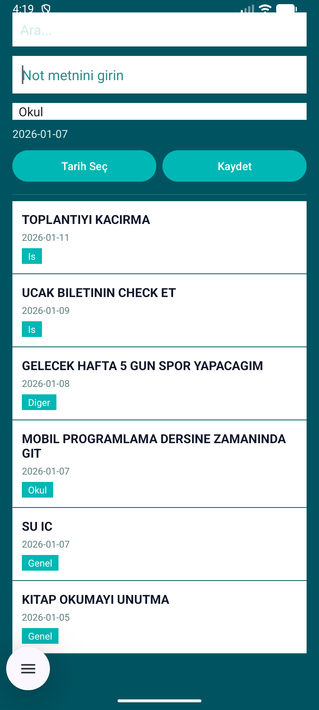

#  Not Defteri Uygulaması

Android platformu için kategori ve tarih bazlı not yönetim uygulaması.

##  Özellikler

- Not ekleme, düzenleme ve silme
- Kategori bazlı organizasyon (Genel, İş, Okul, Diğer)
- Tarih seçimi ve tarihe göre sıralama
- Not arama ve filtreleme
- SQLite ile yerel veri saklama

## Ekran Görüntüleri

<p align="center">
  
  
</p>

## Teknolojiler

- **Dil:** Java
- **Platform:** Android (Min API 21)
- **Veritabanı:** SQLite
- **IDE:** Android Studio

## 📂 Proje Yapısı

```
app/src/main/
├── java/.../
│   ├── MainActivity.java    # Ana ekran
│   └── DBHelper.java        # Veritabanı
└── res/layout/
    ├── activity_main.xml    # Ana layout
    └── item_note.xml        # Liste item
```

## 💻 Kurulum

1. Repository'yi klonlayın:
```bash
git clone https://github.com/kullaniciadi/not-defteri-uygulamasi.git
```

2. Android Studio'da açın

3. Run butonuna basın

##  Kullanım

**Not Ekle:** Metin gir → Kategori seç → Kaydet  
**Not Güncelle:** Nota tıkla → Güncelle → Düzenle  
**Not Sil:** Nota tıkla → Sil  
**Ara:** Arama çubuğuna yaz


##  Geliştirici

Muhammet Furkan Mengene - Mobil Sistemler Proje Ödevi


---

